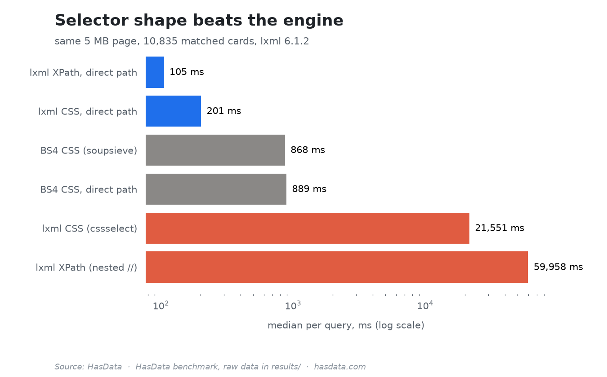

# XPath vs CSS Selector Benchmark


The same logical query through six selector engines on the same 5 MB page, timed. The spread runs from 105 ms to just under 60 seconds per query depending on how the selector is written, which is the point [our XPath vs CSS comparison](https://hasdata.com/blog/xpath-vs-css-selectors) makes at length.

## Table of Contents

- [Results](#results)
- [What Is Measured](#what-is-measured)
- [Running It](#running-it)
- [Disclaimer](#disclaimer)
- [More Resources](#more-resources)

## Results

Raw numbers in `results/`, for the 5 MB dataset and a 1 MB control. Medians per query on the 5 MB page (10,835 matched cards, Python 3.14, lxml 6.1, Windows 11 Pro on an AMD Ryzen 3 5300U with 6 GB of RAM):

| Engine and selector shape | Median per query | Items per second |
|---|---:|---:|
| lxml XPath, direct path | 105 ms | 102,899 |
| lxml CSS, direct path | 201 ms | 53,886 |
| BeautifulSoup CSS (soupsieve) | 868 ms | 12,484 |
| BeautifulSoup CSS, direct path | 889 ms | 12,181 |
| lxml CSS (cssselect), nested | 21,551 ms | 503 |
| lxml XPath, nested `//` | 59,958 ms | 181 |

On a log scale the three orders of magnitude fit one picture:



The engine matters less than the selector shape. The same lxml XPath engine is at both ends of the table, 105 ms when the path is direct and just under 60 seconds when it re-anchors with a nested `//`. BeautifulSoup is mid-table in both shapes, 868 vs 889 ms, so the selector shape barely moves it.

## What Is Measured

A synthetic e-commerce page with nested product cards and noise markup, sized to 5 MB, parsed once per engine. Each engine then runs the same logical query up to 200 times (or 30 seconds, minimum 10 runs), and the JSON records median, P95, minimum, jitter and items per second, the same columns the article's table publishes. The 1 MB control run shows the ordering holds at a smaller size.

## Running It

```bash
pip install lxml cssselect beautifulsoup4
python selector_bench.py
```

The run doesn't touch the network, the dataset is generated in memory, and the results are written to `results/`.

## Disclaimer

The benchmark parses a synthetic page it generates itself. How selectors get used against real sites depends on jurisdiction and terms, and nothing in this repository is legal advice. [Is Web Scraping Legal?](https://hasdata.com/blog/is-web-scraping-legal) covers how we think about the question.

## More Resources

- [XPath vs CSS Selectors](https://hasdata.com/blog/xpath-vs-css-selectors), the comparison these numbers back
- [CSS Selectors Cheat Sheet](https://hasdata.com/blog/css-selectors-cheat-sheet), the reference the fast shapes come from
